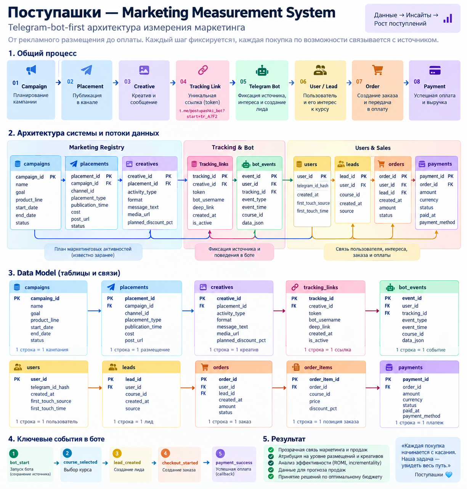

# Поступашки — маркетинговая аналитика и Measurement System

Проект для хакатона **«Поступашки: куда исчезает маркетинг?»**.

Цель проекта — понять, что можно достоверно сказать о связи маркетинга и продаж по текущим данным, восстановить максимум доступной маркетинговой истории и спроектировать систему, которая в будущем позволит связывать рекламные размещения с пользователями, оплатами, ROMI и прогнозом продаж.

---

## Что мы сделали

Проект состоит из пяти связанных блоков:

1. **Исследовали продажи** — динамику, повторные покупки, курсы, выручку и особенности заказов.
2. **Восстановили Marketing History** — собрали маркетинговые события и сопоставили их с продажами во времени.
3. **Проверили attribution и incrementality** — оценили потенциальные маркетинговые касания и краткосрочные изменения продаж после событий.
4. **Спроектировали Measurement System** — Telegram-bot-first архитектуру `campaign → placement → tracking → user → lead → order → payment`.
5. **Построили прогноз продаж** — baseline-модели, линейную регрессию и дизайн будущего marketing-aware forecast после накопления данных Measurement System.

Также реализован **MVP Measurement System**, демонстрирующий end-to-end pipeline от placement до attribution, ROMI и forecast-ready mart.

---

## Ключевой принцип анализа

Мы разделяем выводы на три уровня:

- **KNOW** — что напрямую наблюдаем в данных;
- **ESTIMATE** — что оцениваем моделями, attribution или event study;
- **CANNOT KNOW NOW** — что невозможно достоверно восстановить исторически и что необходимо логировать в будущем.

> Историческое совпадение маркетингового события и роста продаж не является доказательством причинного эффекта.

---

## Данные

Используются два основных источника:

| Файл | Что содержит |
|---|---|
| `data/raw/base.xlsx` | покупки: обезличенный `student_id`, сумма, курс, timestamp |
| `data/raw/marketing_history.xlsx` | восстановленная история маркетинговых событий |

История продаж охватывает короткий период, поэтому сложные прогнозные модели и точный causal ROMI на текущих данных были бы методологически ненадёжны.

> В репозиторий не должны добавляться прямые персональные данные пользователей. Используются только обезличенные идентификаторы из кейса.

---

## Ключевые результаты

### Продажи и маркетинговые события

Анализ показал выраженную краткосрочную связь между некоторыми маркетинговыми активностями и ростом продаж. Наиболее заметный краткосрочный сигнал наблюдается у промо со скидкой: после таких событий продажи часто растут в день публикации и на следующий день.

При этом до маркетинговых событий также наблюдается pre-trend, поэтому результат нельзя трактовать как доказанный causal effect.

### Attribution

Для каждой покупки были найдены **потенциальные** маркетинговые касания по совпадению курса и временного окна.

В 7-дневном окне потенциальное предшествующее касание найдено примерно для **72% продаж**.

Важно: это не наблюдаемая user-level attribution, а историческая реконструкция возможных касаний.

### Incrementality

Для маркетинговых событий использовалась оценка относительно локального baseline до события.

Результаты показывают, что часть событий сопровождается ростом продаж, но эффект неоднороден и не для каждого события продажи оказываются выше baseline.

Без контрольной группы, A/B или holdout такой анализ остаётся приблизительным.

### Forecast

На короткой истории были протестированы простые baseline-подходы и линейная регрессия.

Лучший результат на backtest:

```text
Linear Regression MAE ≈ 13.34 покупки / день
```

Это лучше простого baseline `previous day`, но ошибка всё ещё велика.

Текущий прогноз следует рассматривать как **baseline-сценарий**, а не точную оценку спроса.

---

# Measurement System

Главное ограничение исторических данных — отсутствие устойчивой связи:

```text
marketing source
→ user
→ lead
→ order
→ payment
```

Поэтому мы спроектировали Telegram-bot-first Measurement System.



Целевая цепочка:

```text
Campaign
→ Placement
→ Creative
→ Tracking Link
→ Telegram Bot
→ User / Bot Events
→ Lead
→ Order
→ Payment
→ Revenue
```

Telegram-бот становится центральной точкой user-level tracking:

- принимает `tracking_id` из deep link;
- создаёт/находит обезличенный `user_id`;
- сохраняет `bot_start`;
- фиксирует выбранный курс;
- создаёт `lead`;
- создаёт `order_id`;
- передаёт `order_id` в платёжную систему;
- payment callback связывает оплату с заказом и пользователем.

Полное описание архитектуры и Data Model:

**[docs/measurement_system.md](docs/measurement_system.md)**

---

# MVP

MVP демонстрирует техническую связность предлагаемой системы:

```text
placement
→ creative
→ tracking
→ touch
→ lead
→ real payment
→ attribution
→ ROMI_attr
→ forecast-ready mart
```

Основной notebook:

**[notebooks/mvp/mvp_measurement_system.ipynb](notebooks/mvp/mvp_measurement_system.ipynb)**

Подробное описание MVP:

**[notebooks/mvp/README_MVP.md](notebooks/mvp/README_MVP.md)**

### Что в MVP real, а что demo

| Layer | Статус |
|---|---|
| Sales / payments | **REAL** — из `base.xlsx` |
| Probable orders | **REAL** |
| Placement Registry | **DEMO** |
| Tracking links | **DEMO** |
| User touches | **SYNTHETIC** |
| Leads | **SYNTHETIC** |
| Marketing cost | **SYNTHETIC** |
| Attributed revenue | real payment + demo source |
| ROMI_attr | demo calculator |
| Forecast target | **REAL** sales-layer |

MVP **не утверждает**, что synthetic source исторически действительно вызвал конкретную покупку.

Его задача — показать, как proposed pipeline будет работать после внедрения production tracking.

---

# Прогноз после внедрения Measurement System

Сейчас прогноз строится в основном по временной динамике продаж:

```text
past sales
+ lag features
+ rolling mean
+ weekday
+ trend
→ forecast
```

После накопления истории Measurement System можно будет обучать marketing-aware model:

```text
past sales
+ planned_spend
+ placements
+ channels
+ launch / discount
+ creative type
→ forecast
```

После старта кампании Telegram-бот дополнительно даст:

```text
bot_start
course_selected
leads
checkout_started
```

Эти фактические признаки можно использовать уже для **nowcast** во время кампании.

Для будущей модели рассматривается CatBoost, но он должен быть внедрён только если на честном time-based backtest стабильно превосходит текущий baseline.

Основной notebook:

**[notebooks/sales_forecast.ipynb](notebooks/sales_forecast.ipynb)**

---

# Структура репозитория

```text
hackathon-postupashki/
├── README.md
├── requirements.txt
│
├── data/
│   ├── raw/
│   │   ├── base.xlsx
│   │   └── marketing_history.xlsx
│   └── processed/
│
├── docs/
│   ├── assumptions.md
│   ├── data_dictionary.md
│   ├── measurement_system.md
│   └── measurement_system_architecture.png
│
├── notebooks/
│   ├── purchases_eda.ipynb
│   ├── marketing_eda.ipynb
│   ├── marketing_sales_analysis.ipynb
│   ├── course_campaign_analysis.ipynb
│   ├── attribution_incrementality.ipynb
│   ├── sales_forecast.ipynb
│   └── mvp/
│       ├── README_MVP.md
│       └── mvp_measurement_system.ipynb
│
├── presentation/
└── src/
```

---

# Аналитические notebooks

| Notebook | Содержание |
|---|---|
| [purchases_eda.ipynb](notebooks/purchases_eda.ipynb) | EDA продаж, покупателей, курсов, выручки и повторных покупок |
| [marketing_eda.ipynb](notebooks/marketing_eda.ipynb) | EDA Marketing History и типов маркетинговых событий |
| [marketing_sales_analysis.ipynb](notebooks/marketing_sales_analysis.ipynb) | связь маркетинговых событий с продажами, временные окна и event study |
| [course_campaign_analysis.ipynb](notebooks/course_campaign_analysis.ipynb) | анализ курсов и кампаний |
| [attribution_incrementality.ipynb](notebooks/attribution_incrementality.ipynb) | potential-touch attribution и приблизительная incrementality |
| [sales_forecast.ipynb](notebooks/sales_forecast.ipynb) | baseline, backtest, Linear Regression и будущий forecast design |
| [mvp_measurement_system.ipynb](notebooks/mvp/mvp_measurement_system.ipynb) | end-to-end MVP Measurement System |

---

# Как запустить проект

## 1. Клонировать репозиторий

```bash
git clone https://github.com/perchii/hackathon-postupashki.git
cd hackathon-postupashki
```

## 2. Создать виртуальное окружение

### macOS / Linux

```bash
python3 -m venv .venv
source .venv/bin/activate
```

### Windows

```bash
python -m venv .venv
.venv\Scripts\activate
```

## 3. Установить зависимости

```bash
pip install -r requirements.txt
```

## 4. Запустить Jupyter

```bash
jupyter notebook
```

После этого можно открывать notebooks из папки `notebooks/`.

Для демонстрации MVP:

```text
notebooks/mvp/mvp_measurement_system.ipynb
```

---

# Зависимости

Основной стек:

```text
Python 3.11+
pandas
numpy
matplotlib
openpyxl
scipy
statsmodels
scikit-learn
jupyter
```

Полный список:

**[requirements.txt](requirements.txt)**

---

# Ограничения

Текущий historical analysis ограничен качеством исходных данных:

- история продаж короткая;
- нет полного исторического списка рекламных размещений и их стоимости;
- нет наблюдаемых user-level Telegram touches;
- нельзя надёжно связать исторический payment с конкретным placement;
- historical attribution является реконструкцией, а не deterministic tracking;
- точный historical ROMI посчитать невозможно;
- observational event study не доказывает incrementality.

Именно эти ограничения закрывает proposed Measurement System.

---

# Решение по маркетинговому бюджету

Мы не предлагаем распределять будущий бюджет на основании synthetic ROMI из MVP.

Предлагаемый decision loop:

```text
зарегистрировать placement и cost
→ запустить unique tracking link
→ собрать bot events / leads / payments
→ рассчитать attributed revenue
→ сравнить placements / channels
→ провести A/B или holdout
→ оценить incrementality
→ перераспределить следующий бюджет
```

Таким образом, цель проекта — не угадать «идеальный канал» на неполной истории, а создать **воспроизводимую систему принятия решений по маркетинговому бюджету**.

---

# Основные материалы

- **Measurement System:** [docs/measurement_system.md](docs/measurement_system.md)
- **Measurement System схема:** [docs/measurement_system_architecture.png](docs/measurement_system_architecture.png)
- **MVP:** [notebooks/mvp/mvp_measurement_system.ipynb](notebooks/mvp/mvp_measurement_system.ipynb)
- **MVP documentation:** [notebooks/mvp/README_MVP.md](notebooks/mvp/README_MVP.md)
- **Attribution & Incrementality:** [notebooks/attribution_incrementality.ipynb](notebooks/attribution_incrementality.ipynb)
- **Sales Forecast:** [notebooks/sales_forecast.ipynb](notebooks/sales_forecast.ipynb)
- **Assumptions:** [docs/assumptions.md](docs/assumptions.md)
- **Data Dictionary:** [docs/data_dictionary.md](docs/data_dictionary.md)

---

## Команда

Проект выполнен командой в рамках хакатона «Поступашки».

Работа была разделена между анализом продаж, восстановлением Marketing History, attribution/incrementality, Measurement System, MVP и прогнозированием.
