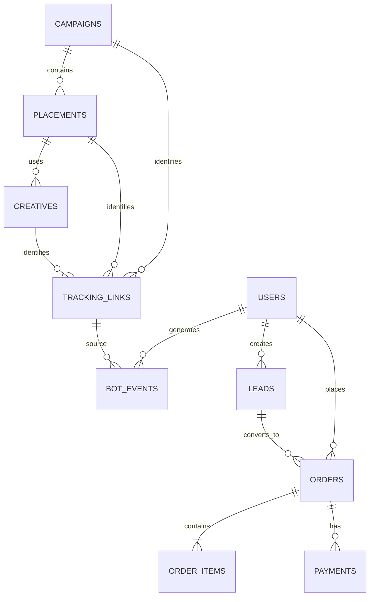

# Поступашки — Marketing Measurement System

**Telegram-bot-first архитектура измерения маркетинга**

Целевая цепочка:

```text
Marketing activity
→ Tracking link
→ Telegram-бот
→ User touch
→ Lead
→ Order
→ Payment
→ Revenue
```

> Цель системы — не потерять источник пользователя между рекламным размещением и оплатой.  
> Если источник не наблюдается, система хранит `direct / organic / unknown`, а не придумывает его.


---

## 1. Зачем нужна Measurement System

Сейчас бизнес хорошо наблюдает нижнюю часть воронки:

- факт оплаты;
- сумму;
- курс;
- время покупки.

Но исторически почти не наблюдается путь пользователя **до оплаты**:

- из какой кампании он пришёл;
- из какого Telegram-канала;
- из какого размещения;
- какой креатив увидел;
- когда перешёл;
- какой курс выбрал;
- дошёл ли до checkout;
- сколько стоило рекламное размещение.

Из-за этого нельзя надёжно связать маркетинг с деньгами и корректно сравнивать размещения по эффективности.

### Что должна решить система

Для каждой покупки по возможности должна восстанавливаться цепочка:

```text
campaign
→ placement
→ creative
→ tracking_id
→ user_id
→ lead_id
→ order_id
→ payment_id
```

Это позволяет начать с платежа и ответить:

> какой пользователь купил → какой lead был создан → по какой tracking-ссылке он пришёл → к какому placement и campaign относится источник.

---

# 2. Из чего состоит система

Measurement System состоит из пяти основных частей.

## 2.1. Marketing Registry

Реестр маркетинговых активностей:

```text
campaign
placement
creative
```

Здесь заранее фиксируются:

- рекламная кампания;
- Telegram-канал;
- конкретное размещение;
- дата и время публикации;
- стоимость;
- продвигаемый курс;
- креатив;
- тип активности.

Именно здесь появляется `cost`, без которого нельзя корректно считать ROMI.

---

## 2.2. Tracking Links

Для каждого измеряемого placement / creative создаётся уникальная deep link:

```text
campaign_id
+ placement_id
+ creative_id
→ tracking_id
→ Telegram deep link
```

Пример:

```text
tracking_id = tr_A7F2

https://t.me/postupashki_bot?start=tr_A7F2
```

В самой ссылке передаётся только короткий token.

Полная расшифровка хранится в таблице `tracking_links`.

---

## 2.3. Telegram-бот

Telegram-бот — центральная точка user-level tracking.

При `/start` бот:

1. получает `tracking_id`;
2. находит campaign / placement / creative;
3. получает Telegram numeric user id;
4. хеширует его;
5. создаёт или находит внутренний `user_id`;
6. пишет событие `bot_start`;
7. предлагает выбрать курс;
8. создаёт `lead`;
9. создаёт `order`;
10. передаёт `order_id` в платёжную ссылку.

Telegram username не используется как основной ключ.

---

## 2.4. Order & Payment Linkage

Оплата связывается с пользователем **не по времени и не по сумме**, а через `order_id`.

```text
lead
→ order
→ payment link metadata
→ payment callback
→ payment
```

Платёжная система возвращает `order_id` в callback.

Это даёт deterministic связь:

```text
payment
→ order
→ lead
→ user
→ tracking source
```

---

## 2.5. Data Model

Все сущности хранятся в отдельных таблицах с:

- однозначной гранулярностью строки;
- собственным Primary Key;
- Foreign Key для связи;
- понятным источником данных.

Основная логика:

```text
campaigns
→ placements
→ creatives
→ tracking_links
→ bot_events
← users
→ leads
→ orders
→ order_items
→ payments
```

---

# 3. Tracking через Telegram-бота

## 3.1. Путь одного пользователя

### A. Маркетолог создаёт размещение

Создаются:

```text
campaign
placement
creative
tracking_id
```

Например:

```text
campaign_id  = CMP_2026_09_PRO
placement_id = PL_0042
creative_id  = CR_0103
tracking_id  = tr_A7F2
```

---

### B. Пользователь видит CTA

В рекламе размещается:

```text
https://t.me/postupashki_bot?start=tr_A7F2
```

---

### C. Пользователь запускает бота

Telegram передаёт:

```text
/start tr_A7F2
```

Бот по token восстанавливает:

```text
campaign_id
placement_id
creative_id
```

и создаёт событие:

```text
event_type = bot_start
```

---

### D. Идентификация пользователя

Используется:

```text
Telegram numeric user_id
→ hash
→ internal user_id
```

Например:

```text
telegram numeric id
→ sha256(...)
→ USR_8F91...
```

Один и тот же пользователь сохраняет один `user_id`.

---

### E. Пользователь выбирает курс

Бот пишет:

```text
event_type = course_selected
```

и создаёт:

```text
lead_id
user_id
course_id
source_tracking_id
```

---

### F. Создаётся заказ

Бот создаёт:

```text
order_id
```

и формирует checkout / payment link.

`order_id` передаётся в metadata платежа.

---

### G. Оплата

После успешной оплаты callback создаёт запись в `payments`.

```text
payment_id
order_id
amount
paid_at
status = succeeded
```

Через `order_id` покупка детерминированно связывается с предыдущими этапами.

---

## 3.2. Повторные входы и multi-touch

Один пользователь может перейти по нескольким рекламным ссылкам.

Например:

```text
10 сентября → tr_A111
12 сентября → tr_B222
14 сентября → tr_C333
```

Все переходы сохраняются.

```text
user_id = один
touches = несколько
```

Новый источник **не перезаписывает** предыдущий.

Это позволяет в дальнейшем строить multi-touch attribution.

---

## 3.3. Direct / organic

Если пользователь открывает бота без payload:

```text
tracking_id = null
source_type = direct / organic
```

Такой пользователь не должен автоматически приписываться последнему известному placement.

---

## 3.4. Какие события логирует бот

| event_type | Когда создаётся | Основные поля | Зачем |
|---|---|---|---|
| `bot_start` | запуск бота | `user_id`, `tracking_id`, `event_time` | фиксируем вход и источник |
| `course_selected` | выбран курс | `user_id`, `course_id`, `event_time` | фиксируем продуктовый интерес |
| `lead_created` | создан lead | `lead_id`, `user_id`, `course_id` | связываем намерение и пользователя |
| `checkout_started` | создан order | `order_id`, `lead_id`, `user_id`, `amount` | начинаем payment flow |
| `payment_success` | callback оплаты | `payment_id`, `order_id`, `amount`, `paid_at` | фиксируем выручку |

---

# 4. Data Model

## 4.1. `campaigns`

**Назначение:** справочник бизнес-кампаний.  
**Гранулярность:** 1 строка = 1 маркетинговая кампания.  
**PK:** `campaign_id`  
**Источник:** Marketing Registry

| Поле | Что хранит | Пример / правило |
|---|---|---|
| `campaign_id` | уникальный ID кампании | `CMP_2026_09_PRO` |
| `name` | название | `PRO September Launch` |
| `goal` | цель | `sales / leads / launch` |
| `product_line` | продуктовая линейка | `START / PRO` |
| `start_date` | плановое начало | `2026-09-12` |
| `end_date` | плановое завершение | `2026-09-20` |
| `status` | статус | `planned / active / finished / cancelled` |

---

## 4.2. `placements`

**Назначение:** реестр конкретных рекламных размещений и собственных публикаций.  
**Гранулярность:** 1 строка = 1 размещение в одном канале в конкретное время.  
**PK:** `placement_id`  
**FK:** `campaign_id`  
**Источник:** Marketing Registry

| Поле | Что хранит | Пример / правило |
|---|---|---|
| `placement_id` | ID размещения | `PL_0042` |
| `campaign_id` | кампания | `CMP_2026_09_PRO` |
| `channel_id` | канал | `TG_CHANNEL_17` |
| `placement_type` | тип площадки | `external / own` |
| `publication_time` | время публикации | `2026-09-13 15:00` |
| `cost` | стоимость placement | `25000` |
| `post_url` | ссылка на публикацию | `https://t.me/...` |
| `course_id` | продвигаемый курс | `ANALYTICS_PRO` |
| `status` | статус | `planned / published / cancelled` |

> Для paid placement `cost` обязателен.

---

## 4.3. `creatives`

**Назначение:** справочник рекламных креативов.  
**Гранулярность:** 1 строка = 1 версия креатива.  
**PK:** `creative_id`  
**FK:** `placement_id`  
**Источник:** Marketing Registry

| Поле | Что хранит | Пример / правило |
|---|---|---|
| `creative_id` | ID креатива | `CR_0103` |
| `placement_id` | placement | `PL_0042` |
| `format` | формат | `text / image / video` |
| `activity_type` | тип сообщения | `sale_post / discount / launch / native` |
| `content_summary` | краткое описание | `Скидка 15% на Analytics PRO` |
| `cta` | призыв к действию | `Запустить бота` |

---

## 4.4. `tracking_links`

**Назначение:** маппинг короткой Telegram deep link на маркетинговый источник.  
**Гранулярность:** 1 строка = 1 уникальная tracking-ссылка.  
**PK:** `tracking_id`  
**FK:** `campaign_id`, `placement_id`, `creative_id`  
**Источник:** генератор tracking-ссылок / Registry

| Поле | Что хранит | Пример / правило |
|---|---|---|
| `tracking_id` | короткий token | `tr_A7F2` |
| `campaign_id` | кампания | `CMP_2026_09_PRO` |
| `placement_id` | размещение | `PL_0042` |
| `creative_id` | креатив | `CR_0103` |
| `bot_deeplink` | Telegram deep link | `t.me/postupashki_bot?start=tr_A7F2` |
| `created_at` | время создания | timestamp |
| `is_active` | активность ссылки | `true / false` |

---

## 4.5. `users`

**Назначение:** единый обезличенный пользователь.  
**Гранулярность:** 1 строка = 1 Telegram-пользователь, взаимодействовавший с ботом.  
**PK:** `user_id`  
**Источник:** Telegram-бот

| Поле | Что хранит | Пример / правило |
|---|---|---|
| `user_id` | внутренний ID | `USR_8F91...` |
| `telegram_user_hash` | hash Telegram numeric ID | `sha256(...)` |
| `first_seen_at` | первое событие | timestamp |
| `first_tracking_id` | первый tracking source | `tr_A7F2 / null` |
| `first_source_type` | первый тип источника | `paid / own / direct` |

---

## 4.6. `bot_events`

**Назначение:** сырой event log действий пользователя в Telegram-боте.  
**Гранулярность:** 1 строка = 1 событие пользователя.  
**PK:** `event_id`  
**FK:** `user_id`, `tracking_id`  
**Источник:** Telegram-бот

| Поле | Что хранит | Пример / правило |
|---|---|---|
| `event_id` | ID события | `EVT_...` |
| `user_id` | пользователь | `USR_...` |
| `event_type` | событие | `bot_start / course_selected / checkout_started` |
| `event_time` | время | timestamp |
| `tracking_id` | источник входа | `tr_A7F2 / null` |
| `placement_id` | placement | `PL_0042 / null` |
| `creative_id` | creative | `CR_0103 / null` |
| `course_id` | курс | `ANALYTICS_PRO / null` |
| `session_id` | сессия | `SES_...` |

---

## 4.7. `leads`

**Назначение:** зафиксированный интерес к конкретному продукту.  
**Гранулярность:** 1 строка = 1 lead / намерение купить конкретный курс.  
**PK:** `lead_id`  
**FK:** `user_id`  
**Источник:** Telegram-бот

| Поле | Что хранит | Пример / правило |
|---|---|---|
| `lead_id` | ID лида | `LEAD_00124` |
| `user_id` | пользователь | `USR_...` |
| `course_id` | выбранный курс | `ANALYTICS_PRO` |
| `created_at` | время создания | timestamp |
| `source_tracking_id` | tracking входа | `tr_A7F2 / null` |
| `status` | статус | `new / checkout / paid / abandoned` |

---

## 4.8. `orders`

**Назначение:** заказ до оплаты.  
**Гранулярность:** 1 строка = 1 заказ.  
**PK:** `order_id`  
**FK:** `user_id`, `lead_id`  
**Источник:** Telegram-бот / checkout

| Поле | Что хранит | Пример / правило |
|---|---|---|
| `order_id` | ID заказа | `ORD_00981` |
| `user_id` | покупатель | `USR_...` |
| `lead_id` | связанный lead | `LEAD_00124` |
| `created_at` | время создания | timestamp |
| `amount_expected` | сумма к оплате | `7990` |
| `currency` | валюта | `RUB` |
| `status` | статус | `created / pending / paid / cancelled` |
| `is_bundle` | пакет | `true / false` |

---

## 4.9. `order_items`

**Назначение:** состав заказа. Нужен для bundle-покупок.  
**Гранулярность:** 1 строка = 1 курс внутри заказа.  
**PK:** `order_item_id`  
**FK:** `order_id`, `course_id`  
**Источник:** Telegram-бот / checkout

| Поле | Что хранит | Пример / правило |
|---|---|---|
| `order_item_id` | ID позиции | `OI_...` |
| `order_id` | заказ | `ORD_00981` |
| `course_id` | курс | `ANALYTICS_PRO` |
| `item_amount` | цена позиции | `7990` |
| `discount_pct` | скидка | `15 / 0` |

---

## 4.10. `payments`

**Назначение:** фактические финансовые события.  
**Гранулярность:** 1 строка = 1 платёжная попытка / транзакция.  
**PK:** `payment_id`  
**FK:** `order_id`  
**Источник:** payment provider callback

| Поле | Что хранит | Пример / правило |
|---|---|---|
| `payment_id` | ID платежа | `PAY_7781` |
| `order_id` | заказ | `ORD_00981` |
| `provider_payment_id` | внешний ID | `provider_...` |
| `amount` | фактически оплачено | `7990` |
| `paid_at` | время оплаты | timestamp |
| `status` | результат | `succeeded / failed / refunded` |
| `payment_method` | метод | `card / sbp / other` |

---

## 4.11. Справочники

Чтобы значения не расползались, используются отдельные справочники.

### `channels`

```text
channel_id
channel_name
channel_type
telegram_url
```

### `courses`

```text
course_id
course_name
product_line
active_flag
```

### `activity_types`

Допустимые значения:

```text
sale_post
discount
launch
native
content
```

### `statuses`

Допустимые статусы для:

```text
campaign
lead
order
payment
```

---

## 4.12. Связи между таблицами



Пример цепочки:

```text
CMP_01
→ PL_42
→ CR_103
→ tr_A7F2
→ USR_91
→ LEAD_124
→ ORD_981
→ PAY_7781
```

---

# 5. Ключевые требования и бизнес-правила

## 5.1. Бот — обязательная точка входа для trackable CTA

Все CTA, которые нужно измерять на user-level, ведут в Telegram-бот через уникальную deep link.

```text
ad
→ tracking link
→ bot
```

---

## 5.2. Telegram username не используется как ID

Основной stitching:

```text
Telegram numeric user_id
→ hash
→ internal user_id
```

---

## 5.3. `tracking_id` и `user_id` — разные сущности

```text
tracking_id = источник входа
user_id     = человек
```

Один пользователь может иметь много tracking sources.

---

## 5.4. Multi-touch сохраняется полностью

Каждый повторный рекламный вход создаёт новый `bot_event`.

Старое касание не перезаписывается.

---

## 5.5. Direct / organic — валидный источник

Если payload отсутствует:

```text
tracking_id = null
source_type = direct / organic
```

---

## 5.6. `cost` обязателен для paid placement

Если рекламное размещение платное:

```text
cost IS NOT NULL
cost >= 0
```

Без cost нельзя корректно сравнивать экономику placements.

---

## 5.7. Payment связывается только через `order_id`

Нельзя связывать оплату только:

- по времени;
- по сумме;
- по приблизительному совпадению.

Используем:

```text
order_id
```

в metadata платёжной ссылки и callback.

---

## 5.8. Callback должен быть идемпотентным

Повторный callback от платёжной системы не должен создавать второй payment.

---

## 5.9. Bundle хранится через `order_items`

```text
1 order
→ N order_items
→ 1 или несколько курсов
```

Не создаём несколько независимых payments только из-за нескольких курсов.

---

## 5.10. Единая timezone

Все timestamp должны храниться:

```text
UTC
```

или в одной согласованной timezone с явным conversion rule.

---

## 5.11. Data validation

Проверяем:

```text
PK uniqueness
FK existence
valid statuses
amount >= 0
cost >= 0
valid timestamps
```

---

## 5.12. Неизвестное не угадываем

Если источник не наблюдается:

```text
tracking_id = null
source = direct / organic / unknown
```

Фиктивное маркетинговое касание не создаётся.

---

# Итоговая архитектура

```text
Marketing Registry
      ↓
campaign
      ↓
placement
      ↓
creative
      ↓
tracking link
      ↓
Telegram bot
      ↓
user + bot events
      ↓
lead
      ↓
order + order_items
      ↓
payment
      ↓
revenue
```

Measurement System делает путь от рекламы до денег воспроизводимым на уровне ключей и событий.

Каждая покупка по возможности связывается с:

```text
payment
→ order
→ lead
→ user
→ touch
→ tracking link
→ creative
→ placement
→ campaign
```

Это создаёт основу для следующих аналитических слоёв:

- attribution;
- ROMI;
- анализ эффективности placements / channels / creatives;
- прогнозирование продаж после накопления истории;
- принятие решений по будущему маркетинговому бюджету.
